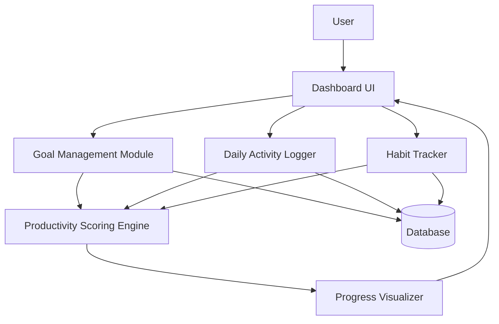

# MakeUrselfBetter

Full-stack self-improvement tracker with daily activity logging, habit management, goal-setting, and productivity scoring. Helps users define goals, set deadlines, and track progress across multiple life aspects.

**Engineering concept:** Full-stack CRUD application, productivity scoring system, goal-tracking state management, TypeScript full-stack architecture.

## Architecture

## Tech Stack
| Layer    | Technology              |
| -------- | ----------------------- |
| Language | TypeScript              |
| Frontend | Next.js / React         |
| Backend  | Next.js API Routes      |
| Database | (configured in project) |
| License  | MIT                     |

## Project Structure

├── myself-tracker/        # Core tracker application  
│   ├── app/               # Next.js App Router pages  
│   ├── components/        # Reusable UI components  
│   ├── hooks/             # Custom React hooks  
│   ├── lib/               # Utility functions  
│   └── api/               # Backend API routes  
├── init_structure.ps1     # Project initialization script  
├── LICENSE  
└── README.md  

├── myself-tracker/        # Core tracker application  
│   ├── app/               # Next.js App Router pages  
│   ├── components/        # Reusable UI components  
│   ├── hooks/             # Custom React hooks  
│   ├── lib/               # Utility functions  
│   └── api/               # Backend API routes  
├── init_structure.ps1     # Project initialization script  
├── LICENSE  
└── README.md  

## Key Features
1. Goal Setting — Create goals with deadlines and priority levels
2. Daily Activity Logging — Log activities against goals each day
3. Habit Tracking — Build and monitor recurring habits
4. Productivity Scoring — Automated score calculated from completion rate and consistency
5. Progress Dashboard — Visual overview of all active goals and habit streaks
6. Full CRUD — Create, read, update, and delete goals, habits, and activities

## How to Run Locally

git clone https://github.com/Jagmohan-Prajapati/MakeUrselfBetter.git  
cd MakeUrselfBetter/myself-tracker  
npm install  
npm run dev  
Visit http://localhost:3000  

## Example Usage

Goal: Read 10 books by December 2026  
Progress: 3/10 books logged  
Streak: 12 days active  
Productivity Score: 74/100  

Habit: Morning workout  
Streak: 8 days  
Status: On track  
